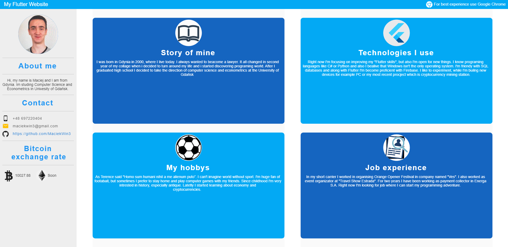

Link to this website: https://my-flutter-website.web.app/?fbclid=IwAR03oyWa8cwjTeTGJvpAB3PPggTpO6DDVajXx2vlHGI83gD3NQpqDqbcLAI#/

# Project Name
> Simple website build using Flutter and Firebase.

## General info
I wanted to create my own webiste, but without using css and html. I discovered that Flutter can be used to creating website, altough sometimes it can be very frustrating and has some faults.

## Technologies
This site is completely build in Flutter and it uses Firebase hosting. It also using API, that updates Bitcoin price in desktop version.

## Screenshots

## Status
Project is in progress, since Flutter web support is not fully developed. When it has more futures and fixed widgets (for example SelectedText) i hope I will finish this website.
